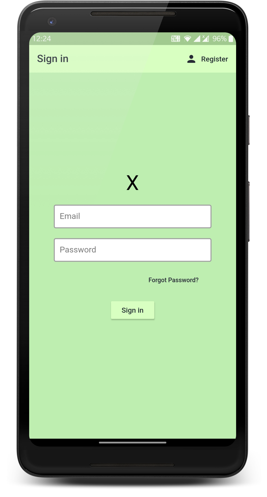
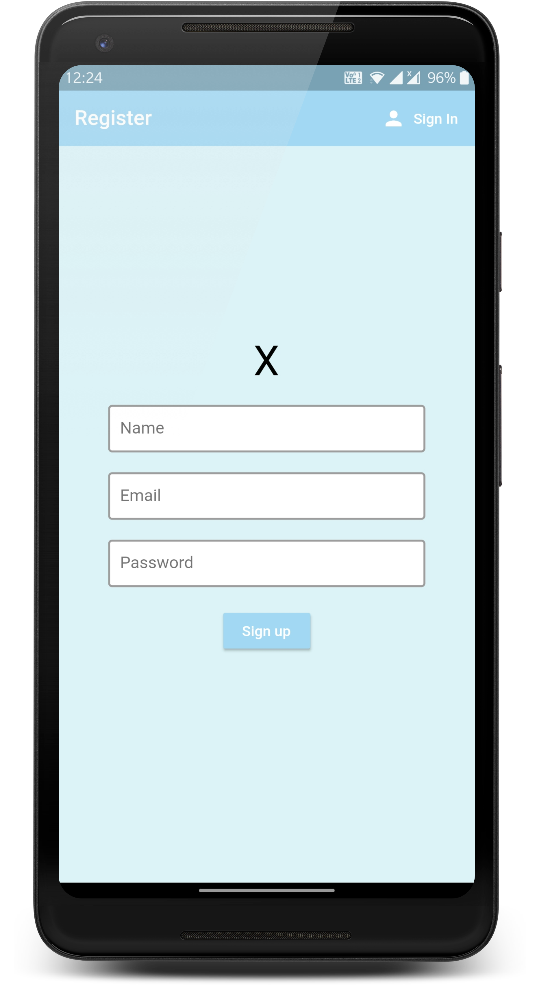
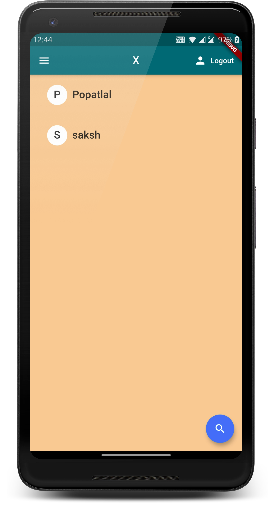
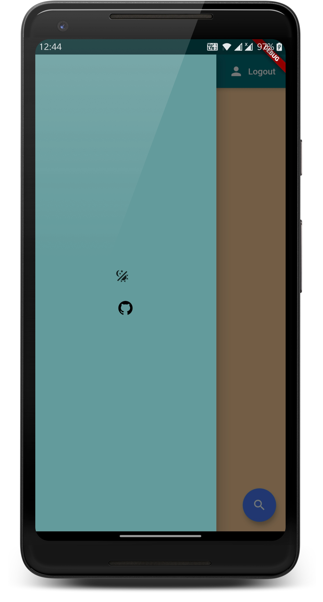
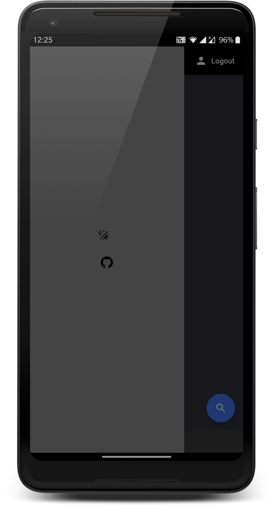
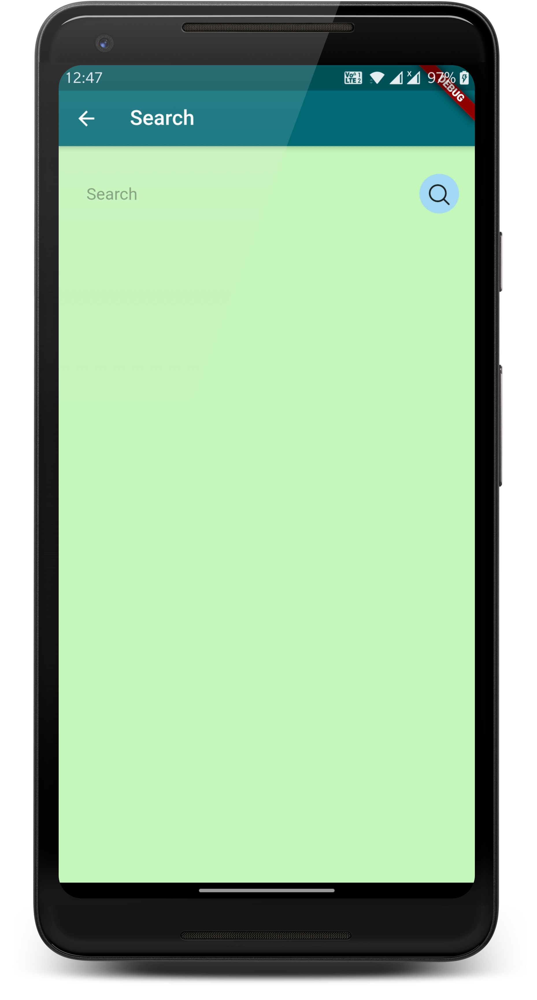
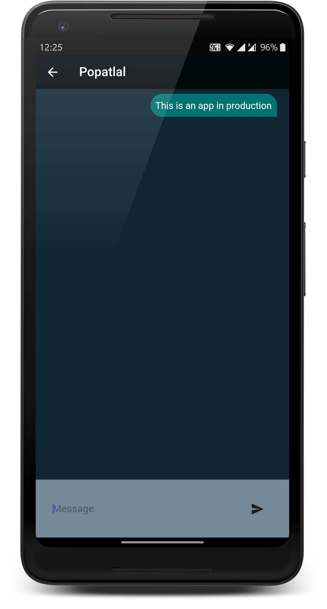

# x

  
 

  <a href="https://github.com/yashimself/x/releases/download/v0.0.1/app-release.apk"> <h3> Download </a>

# Screenshots

# Getting Started

<h3>How to use?</h3>
 
If I personally provided you with a link, download from there. If not, download from releases in the repository above. The navigation is pretty much self explanatory. Make sure you verify your email address after you register.
 
<h3>I encountered a bug. How to report?</h3>
 
You can report bugs by opening an issue on the repository. Providing logs and links with screenshots may help me understand the problem in a better way.
 
<h3>I just had few suggestions. How can I pass it on to development team?</h3>
 
You can contact me from the link above or just open an issue on the repository.
 
<h3>Why not release app on Play Store like all other apps?</h3>
 
To distribute app through Play Store, a payment of $25 is needed to create a developer account, which I don't feel is the necessity right now.
 

# Developers

<h3>Dependencies?</h3>
Follow this guide :
 
<a href="https://flutter.dev/docs/get-started/install">Flutter and Dart SDK</a>
 
You may also need <a href='https://developer.android.com/studio'>Android Studio</a> or you can also use any editor of your choice. [Android Studio is required for Android SDK and if you plan to use emulator]
 
<h3>How to build?</h3>
 
Clone my repo to a directory of your choice. Open terminal and `cd` into that directory. In root directory of the project use command `flutter run -d <your_device>` or just `flutter run`.

